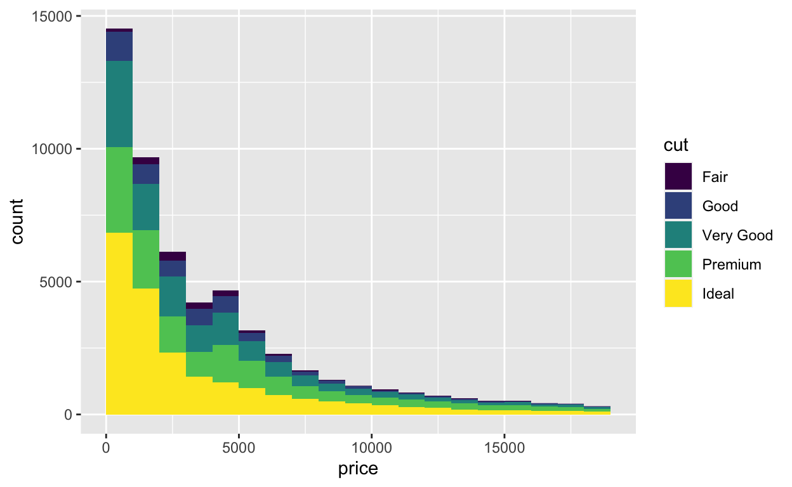

Let's start graphing! 

Start by changing your name above!

## Step 1: 
Complete the following 4 primers. Note that the rest of this activity will ask you to edit this document based on your tutorial answers, so I would review the questions before you dive in. 

1. [Derive information with `dplyr`](https://rstudio.cloud/learn/primers/2.3): practice w/ pipes and other key commands: `summarize()`, `mutate()`, and `group_by()`
2. [Exploratory data analysis](https://rstudio.cloud/learn/primers/3.1) : this one is fairly short (no coding), but it's a good review about how to think about exploring data, categorical and continuous variables, and what types of visualizations are useful for what types of exploration. It's okay with me if you skip this one if you already feel confident with these concepts. 
3. [Bar charts](https://rstudio.cloud/learn/primers/3.2)
4. [Histograms](https://rstudio.cloud/learn/primers/3.3)

Now that we're getting familiar with the RStudio primers, you'll notice that they save your progress - handy!

I would recommend working through them both in the tutorial *and* in a separate .Rmd file on your computer - it will be exeptionally useful to have all the written examples together. 


## Step 2: Show off your work! 

Load all the libraries you need here, so you don't have to worry about it later on: 

```{r include=FALSE}
library(babynames)
library(tidyverse)
```


### Results from "Derive information with `dplyr`"

Recreate your code to complete the two challenges at the end of the "Derive Information with `dplyr`" tutorial:

```{r}

# How many distinct boys names acheived a rank of Number 1 in any year?


# How many distinct girls names acheived a rank of Number 1 in any year?

```

### Results from "Bar Charts"

Recreate your code to complete Exercise 5 in "Bar Charts" (subsection "Aesthetics"). I

>  Create a colored bar chart of the class variable from the mpg data set, which comes with ggplot2. Map the interior color of each bar to class.

```{r}
# Put your code here! Make sure it runs


```


### Results from "Histograms"

Recreate your code to complete Exercise 5 in "Histograms" (subsection "Histograms"). 

> Recreate the histogram below.
>
<!-- >  -->

```{r}
# Put your code here! Make sure it runs


```

### Reflection

In this space, type your answer to the following prompts (no word limit): 

- Were there any particular successes you had?

- What are 2 questions you had or concepts you felt uncomfortable with?

  

### Knit! 

Finally, knit this document to Word, html, or PDF and upload into Blackboard. 

- PDF: If you want to use PDF but are getting an error, install the `tinytex` package. This is a two-step process. Andrew Heiss provides the [clearest explanation.](https://datavizm20.classes.andrewheiss.com/resource/install/)
- html: BB will only let you upload a html file if you compress it first! :cry:

*Note:* If you get a weird error message about `Error in contrib.url(repos,"source")...` comment out the two lines that install your packages.

